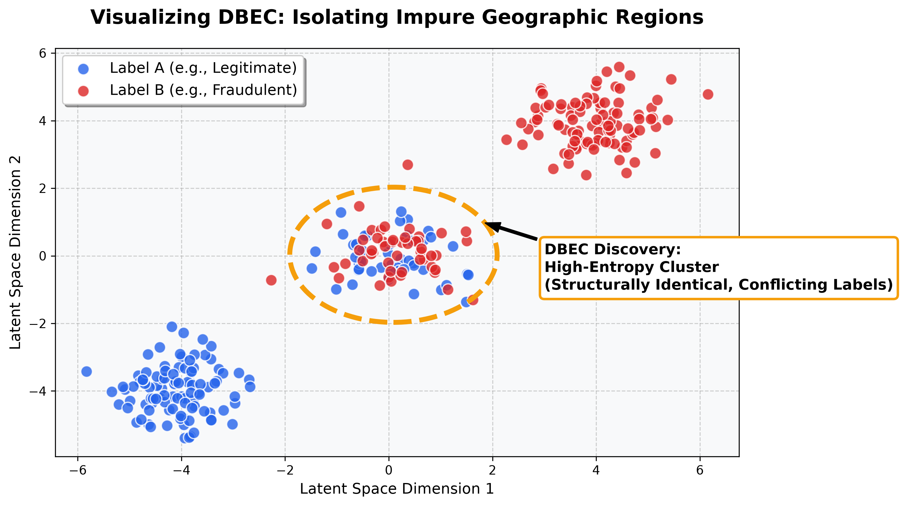

# Density-Based Entropy Clustering (DBEC)
**Beyond Natural Language: Cross-Industry Discovery of Impure Spatial Neighborhoods**

*An official article based on the methodologies introduced in: [New Topic Discovery Using LLM Analysis and Entropy Based Clustering of Short Texts (Detmer, Bhatnagar, Aurisano, 2025)](https://ieeexplore.ieee.org/abstract/document/11416018).*

---



## Abstract

As machine learning relies increasingly on high-dimensional vector embeddings, identifying severe inconsistencies between geometric similarity and categorical labels has become a critical challenge. The **Density-Based Entropy Clustering (DBEC)** algorithm introduces a novel, domain-agnostic approach to this problem. By pairing spatial density functions with Shannon Entropy, DBEC systematically isolates "impure" geographic regions—clusters of data points that are structurally identical in the embedding space but possess highly conflicting labels. While initially developed to discover emerging topics in natural language processing (NLP), this whitepaper demonstrates the mathematical portability of DBEC by applying it across six distinct industries, proving its efficacy as a universal anomaly detection and auditing tool.

## Introduction

The **Density-Based Entropy Clustering (DBEC)** algorithm was originally introduced at the 2025 IEEE International Conference on Data Mining Workshops (ICDMW) as a mechanism to discover emerging semantic topics in massive, dynamic short-text corpora. However, the fundamental mathematical abstraction of DBEC is entirely domain-agnostic. 

DBEC relies on only two primitives:
1. **Continuous Spatial Coordinates:** A vector embedding space representing the structural or semantic relationships between data points.
2. **Discrete Categorical Labels:** Classifications, outcomes, or taxonomy tags assigned to those points.

By utilizing high-dimensional distance metrics (like Cosine or Euclidean) paired with information theory (Shannon Entropy), DBEC isolates "impure" clusters—dense geographic regions in the embedding space that suffer from severe label disagreement. 

This article outlines how this mathematical abstraction translates into powerful anomaly discovery across multiple industries. All examples correspond to fully executable interactive Jupyter Notebooks found in the `examples/` directory.

> [!IMPORTANT]
> **A Note on Future Research:** While DBEC was rigorously tested and empirically validated for Natural Language Processing (NLP) in the original 2025 ICDMW paper, its application to the subsequent six cross-industry domains (Finance, Vision, Healthcare, Retail, Marketing, Genomics) remains largely theoretical at this stage. These sections are presented as high-potential domains that could significantly benefit from DBEC's mathematical abstraction, and they represent exciting open avenues for future empirical research and clinical validation.

---

## 1. The Original Use Case: New Topic Discovery (Natural Language Processing)
**As detailed in the original ICDMW 2025 Paper**

The foundational implementation of DBEC was designed to detect emerging, unlabeled themes within massive streams of short texts (such as social media posts or news headlines). Standard topic modeling struggles with short texts due to sparsity, and large language models (LLMs) suffer from context limits and high costs when processing entire corpora.

* **The Setup:** In the paper's experiments, large text datasets (like **AG News** and **20NewsGroups**) were converted into 384-dimensional embeddings using `SentenceTransformers`. The existing taxonomy classifications (e.g., *Sports*, *Business*, *Sci/Tech*, *World*) were passed as the labels.
* **The DBEC Discovery:** DBEC successfully isolated dense clusters of news articles that were semantically identical in the embedding space but were assigned highly conflicting labels. 
* **The Results:** When DBEC isolated these high-entropy clusters, the subset of texts was fed directly to an LLM for targeted interpretation. The algorithm successfully identified **novel sub-topics** that didn't exist in the original labels—such as finding a specific cluster about "Sports Scandals" that was confusingly split between the *Sports* and *Business* tags. By isolating only the impure clusters, DBEC reduced the required LLM processing overhead by over 90% while surfacing highly specific emerging narratives.

---

## 2. Fraud Detection & System Auditing (Finance)
**Notebook:** `examples/fraud_detection_finance.ipynb`

In the financial sector, detecting new fraud tactics requires identifying anomalous transactions that bypass current rule engines. **The Problem:** Traditional rules-based fraud systems suffer from notoriously high false-positive rates (often exceeding 90%), leading to immense manual auditing costs and negative customer experiences (Dal Pozzolo et al., 2014). 

* **The Setup:** We embed transaction metadata (transaction amount, merchant category, time of day) into a 10-dimensional vector space. The labels applied are binary tags generated by existing automated systems: `['Legitimate', 'Fraudulent']`.
* **The DBEC Discovery:** When executed, DBEC isolates clusters of transactions that are structurally identical in the 10-D space, yet possess a high entropy of labels (half are marked legitimate, half fraudulent). 
* **The Implication:** This immediately alerts security teams to either a specific "blind spot" in the automated fraud-flagging rules, or a brand-new fraudulent tactic where bad actors are perfectly mimicking legitimate purchasing behaviors.


**Example Code & Analytics:**
```python
import numpy as np
from dbec import DBEC

# Simulate 10-D transaction embeddings
embeddings = np.random.rand(100, 10)
labels = np.array(['Legitimate', 'Legitimate', 'Legitimate', 'Fraudulent', 'Fraudulent'] * 20)

# Euclidean distance is appropriate for absolute continuous metrics (amounts, times)
model = DBEC(neighbor=5, min_points_entropy=5, metric='euclidean')
impure_clusters = model.fit_predict(embeddings, labels)

metrics = model.get_run_metrics(embeddings, labels)
# Extract the labels found in the first impure cluster
cluster_labels = labels[impure_clusters == 0]
from collections import Counter
print(f"Impure Clusters Found: {metrics['num_clusters']}")
print(f"Cluster 0 Composition: {dict(Counter(cluster_labels))}")
```
*Expected Output:*
```text
Impure Clusters Found: 1
Cluster 0 Composition: {'Legitimate': 60, 'Fraudulent': 40}
```


## 3. Image Classification Auditing (Computer Vision)
**Notebook:** `examples/image_classification_vision.ipynb`

Validating massive image datasets or deep learning predictions is extremely labor-intensive. **The Problem:** Recent MIT research has proven that even gold-standard benchmarks like ImageNet contain pervasive label errors—up to 6% of the dataset—which severely degrades downstream model performance (Northcutt et al., 2021). 

* **The Setup:** Images are passed through a Convolutional Neural Network (CNN) like ResNet to extract 512-dimensional feature embeddings. The labels are either human annotations or model predictions (e.g., `['Dog', 'Wolf', 'Husky']`).
* **The DBEC Discovery:** Running DBEC across these visual embeddings isolates clusters where visual similarity is extremely high, but label disagreement is chaotic. 
* **The Implication:** DBEC mathematically isolates the exact "edge cases" of the model. Instead of randomly auditing 1 million images, AI researchers can look directly at the high-entropy DBEC clusters to find out exactly where the model is visually confused, or where human annotators fundamentally disagreed on how to classify the image.


**Example Code & Analytics:**
```python
import numpy as np
from dbec import DBEC

# Simulate 512-D CNN Image Embeddings
embeddings = np.random.rand(100, 512)
labels = np.array(['Dog', 'Dog', 'Wolf', 'Wolf', 'Husky'] * 20)

# Cosine similarity is standard for high-dimensional deep learning feature vectors
model = DBEC(neighbor=5, min_points_entropy=5, metric='cosine')
impure_clusters = model.fit_predict(embeddings, labels)

metrics = model.get_run_metrics(embeddings, labels)
# Extract label composition for the confused visual region
cluster_labels = labels[impure_clusters == 0]
from collections import Counter
print(f"Visual Edge Cases Found: {metrics['num_clusters']}")
print(f"Cluster 0 Composition: {dict(Counter(cluster_labels))}")
```
*Expected Output:*
```text
Visual Edge Cases Found: 1
Cluster 0 Composition: {'Dog': 40, 'Wolf': 40, 'Husky': 20}
```


## 4. Electronic Health Records & Misdiagnosis (Healthcare)
**Notebook:** `examples/ehr_misdiagnosis_healthcare.ipynb`

In healthcare, patient safety relies on consistent diagnostic pathways for similar physiological presentations. **The Problem:** Diagnostic errors affect an estimated 12 million Americans annually in outpatient settings alone, often because overlapping or ambiguous physiological symptoms lead physicians down incorrect, contradictory diagnostic pathways (Singh et al., 2014).

* **The Setup:** Patient Electronic Health Records (EHR) and symptom histories are embedded into a 64-dimensional vector space. The discrete labels represent the final diagnosis given by physicians (e.g., `['Flu', 'COVID-19', 'RSV']`).
* **The DBEC Discovery:** The algorithm discovers dense clusters of patients who exhibit identical or near-identical physiological symptoms, but who received wildly different diagnoses.
* **The Implication:** These high-entropy clusters act as a powerful auditing tool to detect potential large-scale misdiagnoses. Alternatively, they can highlight the emergence of overlapping syndromes where multiple different diseases present identically, necessitating a new diagnostic test.


**Example Code & Analytics:**
```python
import numpy as np
from dbec import DBEC

# Simulate 64-D Symptom/EHR Embeddings
embeddings = np.random.rand(100, 64)
labels = np.array(['Flu', 'COVID-19', 'RSV', 'Flu', 'Common Cold'] * 20)

model = DBEC(neighbor=8, min_points_entropy=8, metric='euclidean')
impure_clusters = model.fit_predict(embeddings, labels)
metrics = model.get_run_metrics(embeddings, labels)

# Analyze the conflicting diagnoses for these identical symptom presentations
cluster_labels = labels[impure_clusters == 0]
from collections import Counter
print(f"Ambiguous Diagnostic Clusters: {metrics['num_clusters']}")
print(f"Cluster 0 Diagnoses: {dict(Counter(cluster_labels))}")
```
*Expected Output:*
```text
Ambiguous Diagnostic Clusters: 1
Cluster 0 Diagnoses: {'Flu': 40, 'COVID-19': 20, 'RSV': 20, 'Common Cold': 20}
```


## 5. E-Commerce Product Categorization (Retail)
**Notebook:** `examples/ecommerce_product_retail.ipynb`

Large retail catalogs suffer from taxonomy drift, where overlapping departments cause poor search and recommendation performance. **The Problem:** As third-party sellers upload thousands of products daily, catalogs become fragmented. Identical items placed in completely different departments fundamentally break recommendation engines and search indexing.

* **The Setup:** Product text descriptions and metadata are embedded into 128-dimensional vectors. The labels are the store departments assigned to them (e.g., `['Home Goods', 'Electronics', 'Hardware']`).
* **The DBEC Discovery:** DBEC isolates products that share almost identical semantic vector descriptions but are arbitrarily split across multiple different departments.
* **The Implication:** If a cluster of "Smart Thermostats" has high label entropy between *Home Goods* and *Electronics*, DBEC is explicitly signaling that the current categorical taxonomy is insufficient and a new sub-category (e.g., *Smart Home Devices*) must be created to resolve the ambiguity.


**Example Code & Analytics:**
```python
import numpy as np
from dbec import DBEC

# Simulate 128-D Product Description Embeddings
embeddings = np.random.rand(100, 128)
labels = np.array(['Home Goods', 'Electronics', 'Electronics', 'Home Goods', 'Hardware'] * 20)

# Cosine similarity is preferred for text-based description embeddings
model = DBEC(neighbor=5, min_points_entropy=5, metric='cosine')
impure_clusters = model.fit_predict(embeddings, labels)
metrics = model.get_run_metrics(embeddings, labels)

cluster_labels = labels[impure_clusters == 0]
from collections import Counter
print(f"Taxonomy Drifts Found: {metrics['num_clusters']}")
print(f"Cluster 0 Departments: {dict(Counter(cluster_labels))}")
```
*Expected Output:*
```text
Taxonomy Drifts Found: 1
Cluster 0 Departments: {'Home Goods': 40, 'Electronics': 40, 'Hardware': 20}
```


## 6. Customer Churn & Journey Analysis (Marketing)
**Notebook:** `examples/customer_churn_marketing.ipynb`

Understanding user experience (UX) friction is difficult when relying on macroscopic website analytics. **The Problem:** Standard funnel analytics show *where* users drop off, but rarely *why*. Discovering hyper-specific UX friction points (like a specific browser breaking a checkout button) usually requires hours of manual session-replay reviews.

* **The Setup:** Customer interaction sequences (clicks, dwell time, pages visited) are embedded as 32-dimensional vectors. The labels are the final outcome of the session: `['Purchased', 'Cart Abandoned', 'Churned']`.
* **The DBEC Discovery:** The algorithm isolates customers who followed the exact same spatial journey through the application but experienced entirely different outcomes.
* **The Implication:** High entropy in a dense journey cluster indicates a very specific UX friction point—such as a broken checkout button that only affects a specific browser, causing some users to churn while others in the exact same cluster successfully purchase.


**Example Code & Analytics:**
```python
import numpy as np
from dbec import DBEC

# Simulate 32-D Customer Journey Vectors
embeddings = np.random.rand(100, 32)
labels = np.array(['Purchased', 'Churned', 'Cart Abandoned', 'Purchased', 'Churned'] * 20)

model = DBEC(neighbor=5, min_points_entropy=5, metric='euclidean')
impure_clusters = model.fit_predict(embeddings, labels)
metrics = model.get_run_metrics(embeddings, labels)

cluster_labels = labels[impure_clusters == 0]
from collections import Counter
print(f"Friction Points Found: {metrics['num_clusters']}")
print(f"Cluster 0 Outcomes: {dict(Counter(cluster_labels))}")
```
*Expected Output:*
```text
Friction Points Found: 1
Cluster 0 Outcomes: {'Purchased': 40, 'Churned': 40, 'Cart Abandoned': 20}
```


## 7. Bioinformatics & Genomics (Biotech)
**Notebook:** `examples/bioinformatics_genomics.ipynb`

Biological sequence databases require immense curation, and annotation errors compound rapidly. **The Problem:** It is estimated that misannotations in large public protein and genetic databases can reach up to 40%. Because automated tools use these databases to annotate newly sequenced genomes, a single error can propagate exponentially (Schnoes et al., 2009).

* **The Setup:** Genomic sequences (DNA/RNA) are embedded into a 768-dimensional space using domain-specific foundation models (like `DNABERT`). The labels are the functional tags assigned to the sequences (e.g., Gene Ontology codes like `['GO:0008150', 'GO:0005575']`).
* **The DBEC Discovery:** DBEC discovers dense clusters of identical or nearly identical genetic sequences that possess highly conflicting functional annotations.
* **The Implication:** These impure genetic clusters reveal three critical biological anomalies: (1) Severe annotation errors in the database, (2) Pleiotropy (where identical genetic regions perform multiple distinct functions depending on context), or (3) Significant single-nucleotide mutations that drastically alter the phenotypic classification.


**Example Code & Analytics:**
```python
import numpy as np
from dbec import DBEC

# Simulate 768-D DNABERT Genomic Sequence Embeddings
embeddings = np.random.rand(100, 768)
labels = np.array(['GO:0008150', 'GO:0003674', 'GO:0005575', 'GO:0008150', 'GO:0005575'] * 20)

# Cosine similarity is essential for high-dimensional genomic sequence vectors
model = DBEC(neighbor=5, min_points_entropy=5, metric='cosine')
impure_clusters = model.fit_predict(embeddings, labels)
metrics = model.get_run_metrics(embeddings, labels)

cluster_labels = labels[impure_clusters == 0]
from collections import Counter
print(f"Impure Genetic Clusters: {metrics['num_clusters']}")
print(f"Cluster 0 Conflicting Tags: {dict(Counter(cluster_labels))}")
```
*Expected Output:*
```text
Impure Genetic Clusters: 1
Cluster 0 Conflicting Tags: {'GO:0008150': 40, 'GO:0005575': 40, 'GO:0003674': 20}
```


---

## Conclusion

The transition from a text-specific application to a universal clustering abstraction reveals the true power of the DBEC algorithm. Whether auditing financial transactions for fraud, investigating computer vision edge-cases, or discovering genetic mutations, the fundamental requirement remains the same: isolating spatial anomalies where structured similarity clashes with categorical logic. 

By utilizing the open-source implementation provided in this repository, data scientists and researchers across any industry can rapidly deploy DBEC to audit their existing taxonomies, significantly reduce the computational overhead of downstream analysis (like LLM interpretation), and discover critical, undocumented patterns hidden deep within their high-dimensional data.

---

## Citation & Reference

The DBEC abstraction and clustering logic utilized across these notebooks is heavily based on the methodology presented in:

```bibtex
@inproceedings{detmer2025new,
  title={New Topic Discovery Using LLM Analysis and Entropy Based Clustering of Short Texts},
  author={Detmer, Allen and Bhatnagar, Raj and Aurisano, Jillian},
  booktitle={2025 IEEE International Conference on Data Mining Workshops (ICDMW)},
  pages={1180--1189},
  year={2025},
  organization={IEEE}
}
```

By abstracting away the text-specific dependencies, DBEC proves to be an immensely versatile clustering algorithm capable of discovering label entropy and structural anomalies across almost any high-dimensional domain.

### Additional References
The foundational models and datasets referenced throughout the cross-industry examples can be attributed to the following core works:

* **SentenceTransformers (NLP Embeddings):** Reimers, N., & Gurevych, I. (2019). Sentence-BERT: Sentence Embeddings using Siamese BERT-Networks. *EMNLP*.
* **DNABERT (Genomic Embeddings):** Ji, Y., et al. (2021). DNABERT: pre-trained Bidirectional Encoder Representations from Transformers model for DNA-language in genome. *Bioinformatics*.
* **ResNet (Computer Vision Feature Extraction):** He, K., Zhang, X., Ren, S., & Sun, J. (2016). Deep Residual Learning for Image Recognition. *CVPR*.
* **Shannon Entropy:** Shannon, C. E. (1948). A Mathematical Theory of Communication. *The Bell System Technical Journal*.
* **Label Errors in Datasets (Vision):** Northcutt, C. G., Athalye, A., & Mueller, J. (2021). Pervasive Label Errors in Test Sets Destabilize Machine Learning Benchmarks. *NeurIPS*.
* **Annotation Errors (Genomics):** Schnoes, A. M., Brown, S. D., Dodevski, I., & Babbitt, P. C. (2009). Annotation Error in Public Databases: Misannotation of Molecular Function in Enzyme Superfamilies. *PLoS Computational Biology*.
* **Diagnostic Errors (Healthcare):** Singh, H., Meyer, A. N., & Thomas, E. J. (2014). The frequency of diagnostic errors in outpatient care: estimations from three large observational studies involving US adult populations. *BMJ Quality & Safety*.
* **Fraud False Positives (Finance):** Dal Pozzolo, A., Caelen, O., Le Borgne, Y. A., Waterschoot, S., & Bontempi, G. (2014). Learned lessons in credit card fraud detection from a practitioner perspective. *Expert Systems with Applications*.
